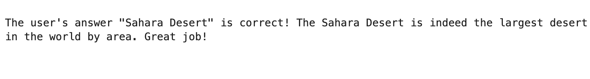
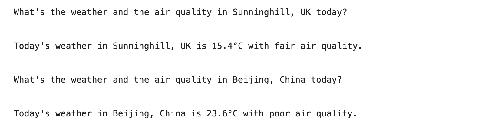

#  OpenAI Assistants API with Function Calling Examples

## Quiz

I created a Geography quiz question creating function, which is used by the Assistant. The idea with function calling is that the assistant can populate the arguments of our function and also act upon the return value if there is one.

The `quiz.ipynb` notebook provides an example to how we can use Function Calling with the OpenAI Assistants API.




## Air Temperature and Air Quality

Building on the knowledge from the previous example, I extended the function calling capability first by calling 2 functions parallel (`parallel_function_calls.py`) and then, used the  `Weather API` and the `Air Quality API` by [Open Meteo](https://open-meteo.com/) to demonstrate this functionality whith a real world application example. (`current-weather.ipynb`)




---

## How to run this project?

0. Prerequisites:

   - Make sure Python3 is installed.
   - If you don't have an account with OpenAI, create one here: https://openai.com/ then create a project API key under Dashboard / API keys.

1. Clone the project.

2. Create a virtual environment inside the project folder:

   `python -m venv venv`

3. Activate the virtual environment:

   Mac: `source venv/bin/activate`

   Windows: `venv\Scripts\activate`

4. Select interpreter in VSCode:

   (on Mac) - Cmd + Shift + P  ---> Select Interpreter ---> Select the created `venv` environment

   (on Windows) - 

5. Install the python dependencies:

   `pip install -r requirements.txt`


6. Create an `.env` file in the root folder and add your project's API key:

   ```
   OPENAI_API_KEY=your-unique-opanai-project-key
   ```

7. Run Jupyter Notebook:

   `jupyter notebook`

8. Run the code snippets in the given/desired order.


## Credits


- OpenAI: https://openai.com

- https://open-meteo.com/